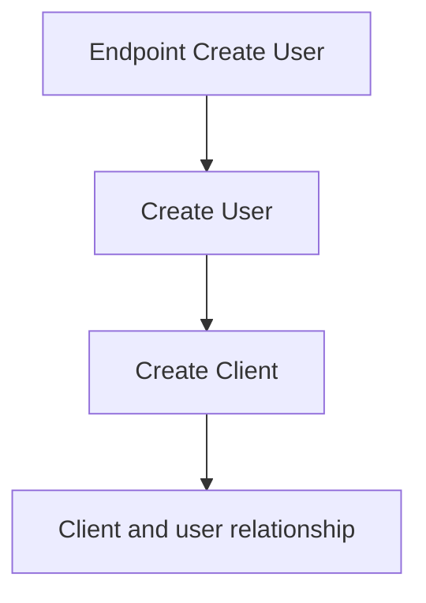
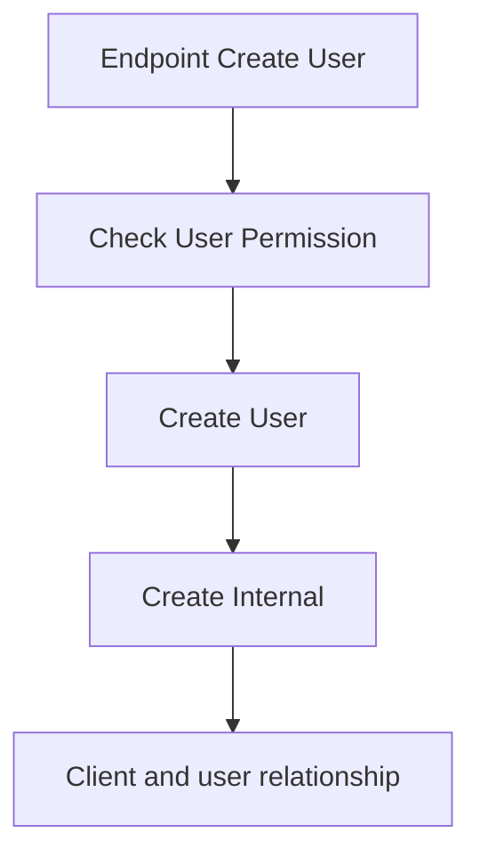

O *User* se trata de uma entidade comum que pode ser relacionado com uma entidade *Client* ou *Internal*. Essas relações definem usuários internos e usuários clientes. Cada um tem regras de negócios diferentes para *CRUD* e operações.

## Client User

O *Client User* representa um cliente que utiliza e consome do serviço fornecido pelo sistema. 

Ao criar uma conta o usuário precisa fornecer os seguintes dados:

- Email
- Password
- Name
- Last Name
- CPF (opcional)
- Endereço (opcional)

Fluxo para criar um *Client User*:

### User Address

Um usuário opcionalmente pode adicionar um endereço ao criar uma conta. Mas ele se torna obrigatório ao realizar um pedido. As informações necessárias para o *user address* são:

- Street Address
- Number
- CEP
- Complement

---
## Internal User

O *Internal User* representa um usuário com permissões especiais para gerenciamento do sistema e procedimentos. Apenas usuários internos com permissão de `manage_users` podem criar, editar e desativar usuários. Deletar um *Internal User* só pode ser feito por um usuário com a role reservada `super_admin` (ver [[#Bootstrap|Bootstrap]]), após o *Internal User* ser desativado.

Para criar um *Internal User* é necessário os seguintes dados:

- Email
- Password
- Name
- Last name
- CPF
- Role

Fluxo para criar um *Internal User*:

### Roles

As *roles* se tratam de um conjunto de permissões que um usuário interno pode ter. Uma role pode ser criada por um usuário que tenha a permissão `manage_roles`. Para criar uma role é necessário as seguintes informações:

- Name
- Permissions

As *permissions* são pré-definidas no sistema (catálogo fixo, ver [[#Permissions|Permissions]]) e associadas a uma role por uma relação N:N — uma role pode ter várias permissões, e uma permissão pode estar em várias roles. Uma role só aceita *permissions* válidas (existentes no catálogo).

> Modelo de dados: `permission(id, name)` como catálogo fixo (seed com as 5 linhas da tabela abaixo) e `role_permission(role_id, permission_id)` como tabela de associação N:N. Nenhuma das duas existe ainda no diagrama (`docs/data-modeling/data_modeling.drawio`) — `internal_role` lá é só `(id, name)` — precisa ser atualizado manualmente.

## Permissions

| Permission         | Description                                                                                                                                                                |
| ------------------ | -------------------------------------------------------------------------------------------------------------------------------------------------------------------------- |
| manage_users       | Permissão para gerenciar usuários. Possibilita criar, editar e desativar um usuário                                                                                        |
| manage_roles       | Permissão para gerenciar usuários. Possibilita criar, editar e deletar roles                                                                                               |
| manage_products    | Permissão para gerenciar produtos. Possibilita criar, editar, deletar e alterar o status de produtos. Também permite modificar os ingredientes ao qual um produto depende. |
| manage_ingredients | Permissão para gerenciar os ingredientes cadastrados no sistema. Possibilita cadastrar, editar, deletar e alterar o status de um ingrediente.                              |
| manage_promotions  | Permissão para gerenciar os combos e promotions existentes. Possibilita criar, editar, deletar e alterar o status de um combo/promotion.                                   |

## Bootstrap

O primeiro *Internal User* do sistema não pode ser criado pelo fluxo normal, já que esse fluxo exige a permissão `manage_users` — que ninguém ainda possui. Por isso, na primeira subida do sistema, um seed/migration cria:

1. Uma role reservada `super_admin`, com todas as permissões do catálogo;
2. Um *Internal User* inicial associado a essa role.

A role `super_admin` é a única com poder de deletar um *Internal User* (ver [[#Internal User|Internal User]]). Ela não pode ser deletada nem ter suas permissões removidas por outra role.

---
## Guest User

Representa um usuário que não possui um cadastro, ou seja, não é um *Client User*. Esse usuário permite que um consumidor possa utilizar dos serviços, sem a necessidade de passar pelo fluxo de cadastro/login. Utilizar o sistema desta forma limita a experiência do usuário, pois inúmeras funcionalidades ficam indisponíveis. Funcionalidades como:

- Acúmulo de pontos;
- Utilização de pontos;
- Preenchimento automático de dados necessário ao fazer um pedido;
- Salvar endereços;
- Salvar formas de pagamento.
- Histórico de pedidos

Nenhum dado desse tipo de usuário fica persistido. Apenas o necessário para a realização de análises de negócio. Exemplos de casos onde dados de Guest User podem ser salvos:

- Histórico de pedidos geral;
- Analytics (mediante aceite do usuário).